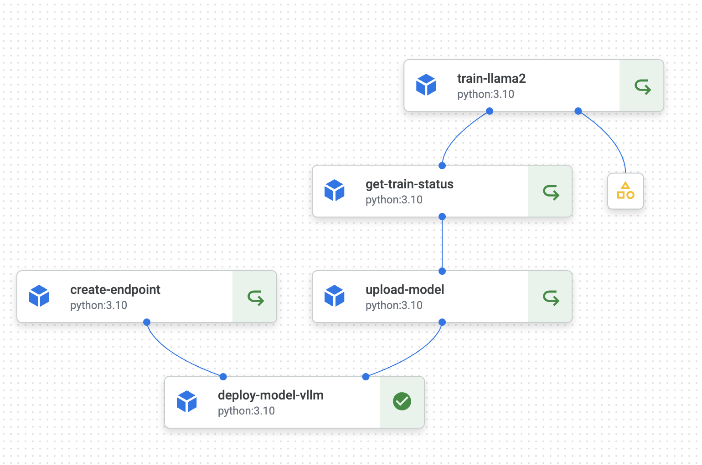

## MLOps

This folder demonstrates how to ochestrate Llama2 training and serving pipeline - LLMOps on Google Cloud. 
## Framework

Tuning is based on Deepspeed and Torchrun launcher. Serving is based on vLLM.

## Cloud Services
Pipeline, training job and serving are all running on Vertex AI.
- Pipeline: Vertex AI Pipeline.

- Training - Vertex AI Custom Training

- Serving - Vertex AI Endpoint

- Save model and endpoint information - FireStore(DataStore)

## Architecture

